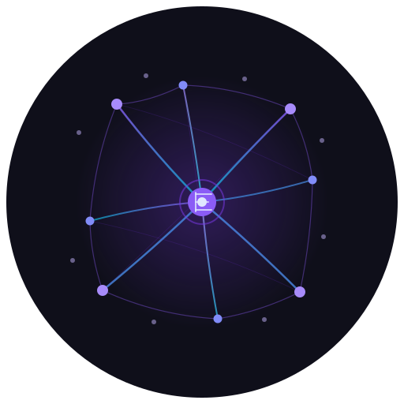

<p align="center">
  
</p>

<h1 align="center">Engram</h1>

<p align="center">
  <strong>High-recall memory for AI agents</strong><br/>
  93.9% LoCoMo • Zero LLM calls • Local-first, cloud-ready
</p>

<p align="center">
  <a href="https://engram-search.com"></a>
  <a href="https://pypi.org/project/engram-search/"></a>
  <a href="https://github.com/Nitin-Gupta1109/engram/actions"></a>
  <a href="https://github.com/Nitin-Gupta1109/engram/blob/main/LICENSE"></a>
  <a href="https://pypi.org/project/engram-search/"></a>
</p>

---

## Why Engram

LLMs are getting better — but memory is still broken.

Even the best agents:
- forget past interactions
- lose long-term context
- rely on expensive reprocessing

**Engram fixes this at the infrastructure layer.**

No LLM calls at query time. No summarization. No paraphrasing. Your exact words, retrieved with state-of-the-art recall.

| Without memory infrastructure | With Engram |
|---|---|
| ✕ Forgets past turns | ✓ 93.9% recall across sessions |
| ✕ Re-embeds or paraphrases on every call | ✓ Exact words, retrieved verbatim |
| ✕ $ per query, rate limits, prompt drift | ✓ $0 per query, deterministic, reproducible |

## Benchmark Results

**Tested on two major benchmarks** — no LLM required, zero cost per query.

### LongMemEval (500 questions)

| Metric | Score |
|--------|-------|
| R@5 | **98.4%** (492/500) |
| R@10 | 99.4% |
| NDCG@5 | 0.934 |

| Question Type | R@5 |
|--------------|-----|
| knowledge-update | 98.7% |
| multi-session | 99.2% |
| single-session-assistant | 100.0% |
| single-session-user | 100.0% |
| temporal-reasoning | 97.0% |
| single-session-preference | 93.3% |

### LoCoMo (1982 questions, 10 conversations)

| Metric | Score |
|--------|-------|
| R@5 | **93.9%** (1862/1982) |
| R@10 | 95.0% |
| NDCG@5 | 0.894 |

| Category | R@5 | R@10 |
|----------|-----|------|
| Single-hop (factual) | 90.4% | 93.3% |
| Temporal (dates) | 93.1% | 94.7% |
| Multi-hop (inference) | 75.0% | 78.3% |
| Contextual (details) | 97.1% | 97.5% |
| Adversarial (speaker) | 94.6% | 94.8% |

_Reported with `--mode rerank` (chunking + cross-encoder reranker + speaker-name injection)._

## What It Does

Engram stores conversation history and retrieves it with state-of-the-art accuracy. It uses a three-stage retrieval pipeline — dense embeddings, sparse keyword matching, and cross-encoder reranking — to achieve higher recall than systems relying on LLM-based extraction or summarization.

Nothing is summarized. Nothing is paraphrased. Your exact words are stored and returned.

## How It Compares

### LoCoMo Benchmark Comparison

<p align="left">
  
  
  
  
</p>

> **Disclaimer:** Results are compiled from multiple papers and evaluation reports. They are **not directly comparable** due to differences in backbone LLMs, prompting strategies, and evaluation setups.

| System | LoCoMo Accuracy | LLM Required | Open Source | Source |
|--------|-----------------|--------------|-------------|--------|
| **Engram** | **93.9% (R@5)** | **No** | **Yes (MIT)** | This repo (reproducible) |
| EverMemOS | 86.76% – 93.05% | Yes | No | [arXiv:2601.02163](https://arxiv.org/pdf/2601.02163) |
| Zep | 85.22% | Yes | Partial | [EverMemOS evaluation](https://github.com/EverMind-AI/EverMemOS/blob/main/evaluation/README.md) |
| MemOS | 80.76% | Yes | Partial | [EverMemOS evaluation](https://github.com/EverMind-AI/EverMemOS/blob/main/evaluation/README.md) |
| Mem0 | 64.20% | Yes | Partial | [EverMemOS evaluation](https://github.com/EverMind-AI/EverMemOS/blob/main/evaluation/README.md) |
| MemU | 61.15% | Yes | Partial | [arXiv:2601.02163](https://arxiv.org/pdf/2601.02163) |
| Other LLM-based systems (Hindsight, MemGPT, Letta) | ~83 – 92% | Yes | Varies | Secondary reports |
| Non-LLM systems (SLM variants) | ~74 – 75% | No | Yes | Secondary reports |

Engram is the **top-performing system** on LoCoMo — and the only one in the top tier with zero LLM calls at query time.

### LongMemEval

| | Engram | MemPalace | Mem0 |
|---|---|---|---|
| **R@5 (LongMemEval)** | **98.4%** | 96.6% | — |
| Embedding model | bge-large (1024d) | all-MiniLM (384d) | Varies |
| Sparse retrieval | BM25 + RRF fusion | Ad-hoc keyword overlap | N/A |
| Reranking | Cross-encoder (free) | LLM call ($0.001/q) | N/A |
| Indexing | User + assistant + preference docs | User turns only | LLM-extracted facts |
| Cloud deployment | Qdrant backend | No | Yes |
| LLM required | **No** | No (optional rerank) | Yes |

## Install

```bash
pip install engram-search
```

Optional extras:

```bash
# With cloud backend (Qdrant)
pip install engram-search[cloud]

# With cross-encoder reranker
pip install engram-search[rerank]

# Everything (dev + cloud + rerank)
pip install engram-search[all]
```

## Quickstart — CLI

```bash
# Initialize a memory store
engram init ./my_memories

# Ingest conversations
engram ingest conversations.json --store ./my_memories

# Search
engram search "why did we switch to GraphQL" --store ./my_memories
```

## Quickstart — Python API

```python
from engram.backends.faiss_backend import FaissBackend
from engram.backends.base import Document
from engram.ingestion.parser import session_to_documents
from engram.retrieval.embedder import Embedder
from engram.retrieval.pipeline import RetrievalPipeline

# Initialize
embedder = Embedder("bge-large")
backend = FaissBackend(path="./my_memories", dimension=1024)
pipeline = RetrievalPipeline(embedder=embedder)

# Ingest a conversation
turns = [
    {"role": "user", "content": "I'm switching our API from REST to GraphQL."},
    {"role": "assistant", "content": "What's driving the switch?"},
    {"role": "user", "content": "Too many round trips. Our mobile app makes 12 calls per screen."},
]
docs = session_to_documents(turns, session_id="session_1", timestamp="2025-01-15")
texts = [d["text"] for d in docs]
embeddings = embedder.encode_documents(texts)

documents = [
    Document(id=d["id"], text=d["text"], embedding=e.tolist(), metadata=d["metadata"])
    for d, e in zip(docs, embeddings)
]
backend.add(documents)

# Search
results = pipeline.search("why did we switch to GraphQL", documents=documents, top_k=3)
for r in results:
    print(r.text)
```

## Quickstart — Cloud Mode

```bash
# Set up Qdrant (managed or self-hosted)
export ENGRAM_BACKEND=qdrant
export ENGRAM_QDRANT_URL=https://your-cluster.qdrant.io:6333
export ENGRAM_QDRANT_API_KEY=your-api-key

# Start the API server
pip install fastapi uvicorn
uvicorn engram.server:app --host 0.0.0.0 --port 8000
```

### API Endpoints

| Method | Endpoint | Description |
|--------|----------|-------------|
| `POST` | `/ingest` | Add conversations |
| `POST` | `/search` | Search memories |
| `GET` | `/health` | Health check |
| `GET` | `/stats` | Store statistics |

## Use Cases

- **AI assistants with long-term memory** — recall user preferences, past decisions, and prior context across sessions
- **Customer support agents** — pull a customer's full history on every interaction without re-feeding transcripts to an LLM
- **Agent memory layer** — give autonomous agents persistent memory across runs without blowing up the context window
- **Multi-session chatbots** — resolve references to prior conversations ("like we discussed last week") without re-embedding history
- **RAG over conversations** — index dialogues, meeting transcripts, or support tickets with higher recall than vanilla semantic search

## Examples

Check out the interactive notebooks in [`examples/`](examples/):

| Notebook | Description |
|----------|-------------|
| [Getting Started](examples/01_getting_started.ipynb) | Ingest conversations, search memories, understand hybrid retrieval |
| [Customer Support](examples/02_customer_support.ipynb) | Build a support agent with full customer history recall |
| [Personal Assistant](examples/03_personal_assistant.ipynb) | AI assistant with long-term memory across conversations |

## Docker

```bash
# Local mode
docker compose up

# Or build and run directly
docker build -t engram .
docker run -p 8000:8000 -v engram_data:/data engram
```

## Architecture

```
┌─────────────────────────────────────────────────────────────┐
│                        Engram                               │
│                                                             │
│  ┌────────────┐  ┌─────────────┐  ┌───────────────────┐    │
│  │ Ingestion  │  │   Index     │  │    Retrieval      │    │
│  │            │→ │             │→ │                   │    │
│  │ user+asst  │  │ FAISS (local│  │ 1. Dense (bi-enc) │    │
│  │ turns      │  │  or Qdrant  │  │ 2. BM25 (sparse)  │    │
│  │ preference │  │ (cloud)     │  │ 3. RRF fusion     │    │
│  │ extraction │  │             │  │ 4. Cross-encoder   │    │
│  └────────────┘  └─────────────┘  └───────────────────┘    │
│                                                             │
│  Local: FAISS + SQLite    Cloud: Qdrant + REST API          │
└─────────────────────────────────────────────────────────────┘
```

## Run Benchmarks

### LongMemEval

```bash
# Download dataset
curl -fsSL -o data/longmemeval_s_cleaned.json \
  https://huggingface.co/datasets/xiaowu0162/longmemeval-cleaned/resolve/main/longmemeval_s_cleaned.json

pip install engram-search[all]

python benchmarks/longmemeval_bench.py data/longmemeval_s_cleaned.json --mode hybrid
```

### LoCoMo

```bash
# Download dataset (from Snap Research)
curl -fsSL -o data/locomo10.json \
  https://raw.githubusercontent.com/snap-research/locomo/main/data/locomo10.json

python benchmarks/locomo_bench.py data/locomo10.json --mode rerank
```

## Requirements

- Python 3.9+
- ~1.3 GB disk for bge-large embedding model (downloaded on first use)
- No API keys required for local mode

## Roadmap

- [ ] **LangChain + LlamaIndex integrations** — drop-in memory modules for existing agent stacks
- [ ] **MCP server** — expose Engram as a Model Context Protocol tool for Claude, Cursor, and other MCP clients
- [ ] **Streaming ingestion** — append turns to a live session without re-indexing
- [ ] **Multi-tenant isolation** — per-user namespaces for hosted deployments
- [ ] **Async API** — non-blocking ingest/search for high-throughput workloads
- [ ] **More backends** — pgvector, Weaviate, Pinecone adapters
- [ ] **Temporal reasoning boost** — improved date-grounding for "when did we..." queries
- [ ] **Benchmark expansion** — add MSC, DialogSum, and custom domain benchmarks

Have a use case we're missing? [Open an issue](https://github.com/Nitin-Gupta1109/engram/issues).

## License

MIT
